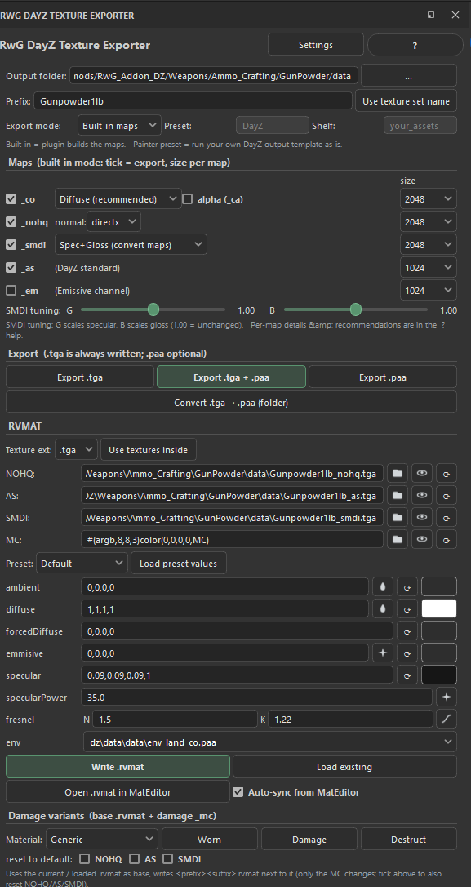
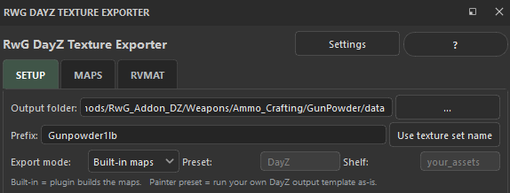
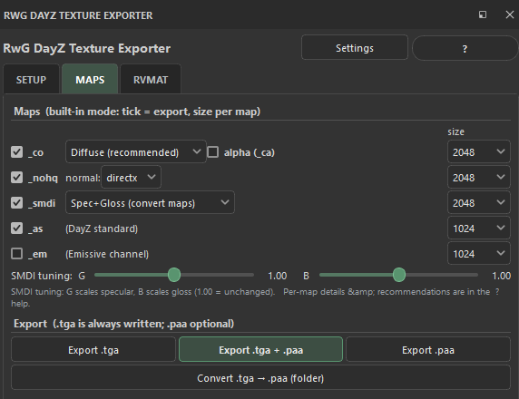
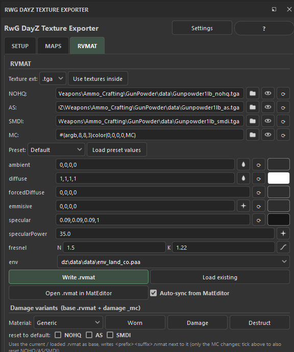
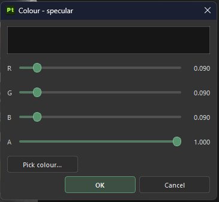
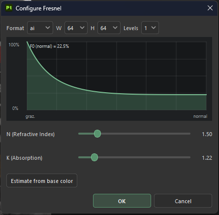
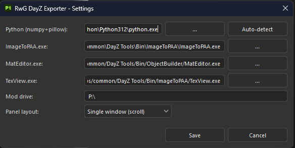

# RwG DayZ Texture Exporter

A **Substance 3D Painter** plugin that turns your project's PBR material into
game-ready **DayZ** textures — `_co` / `_ca`, `_nohq`, `_smdi`, `_as`, `_em` —
plus optional `.paa` conversion and a full **`.rvmat`** editor, all from a dock
inside Painter. It even generates the **damage variants** (`_worn` / `_damage`
/ `_destruct` …) for you.

> **Preview · v0.3.0** — feedback and edge cases welcome!



## Highlights

- **One-click DayZ export** from the active project — each map with its own
  on/off toggle and resolution (256–2048), built from Painter's *converted*
  maps so nothing comes out flat.
- **Three `_smdi` methods**, including a physically-based one that reads each
  metal's real reflectance from the base colour.
- **Full `.rvmat` editor**: texture stages, material colours with live colour
  pickers, a **visual Fresnel curve editor**, an environment-map dropdown, and
  material presets with BI-correct fresnel N/K.
- **Damage-variant generator** — pick a material family and stamp out the
  `_worn` / `_damage` / `_destruct` rvmats in one click (ported from RwG RVMat
  Speedo).
- **Per-project settings** — your values travel with the `.spp`; a new project
  starts from clean defaults.
- **Tabbed or single-window** layout, your choice.

## Screenshots

| Setup | Maps | RVMAT |
|:---:|:---:|:---:|
|  |  |  |

| Colour editor | Fresnel curve editor | Settings |
|:---:|:---:|:---:|
|  |  |  |

## Requirements

- **Substance 3D Painter** (PySide6 on 2024+, PySide2 on older versions — both
  handled automatically).
- A **Python** with `numpy` + `pillow` — used for the built-in map conversion
  (`pip install numpy pillow`). There's an **Auto-detect** in Settings.
- **DayZ Tools `ImageToPAA.exe`** — only for `.paa` output.
- Optional: **TexView / TexView2** and a **MatEditor** (Buldozer material
  editor) for the in-plugin *Open* and *Auto-sync* helpers.

## Install

Copy the **`RwG_DayZ_Painter`** folder into Painter's Python plugins folder:

```
Windows:  C:\Users\<you>\Documents\Adobe\Adobe Substance 3D Painter\python\plugins\
```

Restart Painter (or *Python → Reload Plugins*). You get a dock, a toolbar icon
(RwG logo) and a *Window* menu entry — all three open the panel. See
[`INSTALL.md`](INSTALL.md) and the in-plugin **?** help for the full walkthrough.

## The panel

The dock is split into three tabs (switchable to a single scrolling window in
**Settings → Panel layout**). **Settings** and **?** sit at the top; a status
line sits at the bottom.

### Setup

- **Output folder** — best inside your `P:\` mod path so the `.rvmat` gets
  game-valid texture paths.
- **Prefix** — the file-name base (`wall` → `wall_co.tga`). **Use texture set
  name** fills it from the active texture set.
- **Export mode** — *Built-in maps* (the plugin builds them) or *Painter
  preset* (runs your own saved export template as-is).

### Maps

Each map has its own checkbox and resolution.

- **`_co`** — from Painter's **Diffuse** (metal/rough converted; metals go
  black). *2D View* / *Base Color* are alternatives. Tick **alpha (`_ca`)** to
  add an Opacity alpha and write it as `_ca` instead (transparent materials).
- **`_nohq`** — **Normal DirectX** for DayZ (normal channel + height + baked
  mesh normal, never flat). OpenGL is switchable and remembered per project.
- **`_smdi`** — `R = white, G = specular, B = gloss`, with a source dropdown:
  - **Spec+Gloss (convert maps)** — Painter's converted Specular + Glossiness.
  - **Met+Rough (channels)** — straight from metallic + roughness; metals go to
    a flat full specular.
  - **Met+Rough+BaseColor (PBR)** — physically based: each metal takes its own
    reflectance from the (linearised) base-colour luminance; dielectrics keep
    the `0.04` floor.
  - Two sliders scale the **G** (specular) and **B** (gloss) channels.
- **`_as`** — DayZ layout (R/B white, G = mixed AO). 512 is usually plenty.
- **`_em`** *(optional)* — emissive / glow, straight from the Emissive channel.

`.tga` is always written; **`.paa`** needs ImageToPAA. A **Convert `.tga → .paa`
(folder)** batch tool is included.

### RVMAT

A complete Super-shader `.rvmat` editor:

- **Texture stages** — `NOHQ`, `AS`, `SMDI`, `MC`, each with **browse** (pick a
  file, stored mod-relative), **open** (view in TexView / your default app) and
  **default** (procedural value). **Use textures inside** fills the real
  exported paths.
- **Material presets** — Default plus metals (Gold, Iron, Aluminum, Copper,
  Silver, Steel, Titanium, Nickel, Chrome …) with BI-correct fresnel N/K.
  *Load preset values* fills the fields.
- **Material colours** — `ambient / diffuse / forcedDiffuse / emmisive /
  specular` each show a **coloured button** previewing the value; click it for
  an **RGBA editor** (sliders + live preview + colour picker). Helpers: a
  **tint** icon (average base colour), an **estimate** icon (from the project's
  roughness / emissive), and a **reset** icon.
- **Fresnel** — editable `N` / `K`, or the **Curve** editor: a live
  reflectance-vs-angle graph with an *Estimate from base colour* button.
- **env** — dropdown of the DayZ `dz\data\data` environment maps (Stage7).
- **Write `.rvmat`** / **Load existing** / **Open in MatEditor** with optional
  live **Auto-sync** back into the fields.

### Damage variants

Pick a **material family** (Generic, Wood, Food, Weapons Generic/Metal/Wood,
Plastic, Cloth Tops/Vests/Pants/Shoes) and click a variant button
(*Worn / Damage / Destruct*, *Burn / Rotten*, …). It takes the current base
`.rvmat`, swaps only the **MC (Stage3)** to that damage `_mc`, and writes
`<prefix><suffix>.rvmat` next to it — otherwise identical to the original.
Optional checkboxes also reset NOHQ / AS / SMDI to their defaults.

## Settings

Tool paths and machine/UI options live in the **Settings** dialog and are
stored globally: **Python** (with Auto-detect), **ImageToPAA.exe**,
**MatEditor.exe**, **TexView.exe**, the **Mod drive** (e.g. `P:\`) and the
**Panel layout** (Tabs / Single window).

Everything else (output, prefix, map choices, all RVMAT / material values) is
saved **per project** in the Painter project metadata, so it travels with the
`.spp`. A brand-new project starts from clean defaults. Save the Painter
project to persist the metadata to disk.

## How the `_smdi` is calculated

DayZ packs the `_smdi` as **R = white**, **G = specular level**,
**B = gloss (`= 1 − roughness`)**. The plugin writes `round(value × 255)` per
channel; the **G** / **B** sliders scale each channel. The three methods differ
only in where **G** comes from:

```
Spec+Gloss :  G = clamp(Specular × G_slider, 0, 1)
Met+Rough  :  G = clamp((0.04 + 0.96 × Metallic) × G_slider, 0, 1)
PBR        :  G = clamp(lerp(0.04, luminance(baseColor_linear), Metallic) × G_slider, 0, 1)
```

Spec+Gloss respects a hand-authored specular, Met+Rough is the punchy
full-metal shortcut, and PBR is the reflectance-accurate middle ground (needs
the base colour).

## Known limitations

- The *2D View* `_co` source is the flattened base colour — Painter's API has
  no true shaded-viewport export.
- Painter's Python API can't read a project's normal format, so the plugin
  defaults to **DirectX** (switchable, remembered per project).
- Fresnel N/K can't be uniquely recovered from a metalness map — the *Estimate*
  is an F0-matched starting point; named-metal presets are more accurate.
- Some export details vary by Painter version — if something looks off, open an
  issue with the plugin log.

## Credits

Built by **RwG** for the DayZ modding community. Fresnel N/K values are taken
from the Bohemia Interactive *Super shader* documentation; the damage `_mc`
tables come from the RwG RVMat Speedo tool.

## License

[MIT](LICENSE)
