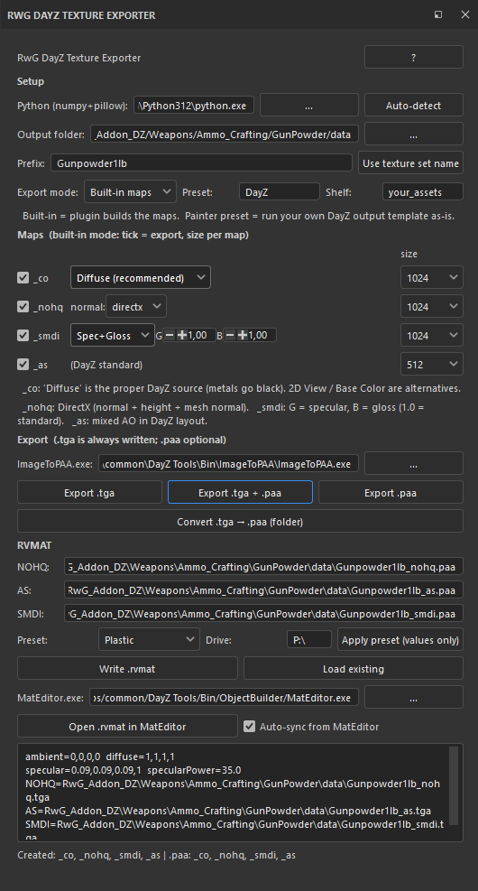

# RwG DayZ Texture Exporter

A **Substance 3D Painter** plugin that turns your project's PBR material into
game-ready **DayZ** textures — `_co`, `_nohq`, `_smdi`, `_as` — plus optional
`.paa` conversion and a matching `.rvmat`, all from a dock inside Painter.

> **Preview · v0.1.0** — first public release. Feedback and edge cases welcome!



## Features

- **One-click DayZ export** of `_co / _nohq / _smdi / _as` from the active
  project — each map with its own on/off toggle and resolution (256–2048).
- **Correct maps via Painter's converted maps**, so nothing comes out flat:
  - `_nohq` → **Normal DirectX** (normal channel + height + baked mesh normal)
  - `_co` → **Diffuse** convert map (metals go black); *2D View* / *Base Color*
    are optional
  - `_smdi` → **Specular + Glossiness** (or computed from metallic + roughness),
    with tunable G/B
  - `_as` → **Mixed AO** in the proper DayZ layout
- **Straight to `.paa`** via DayZ Tools ImageToPAA, plus a batch
  `.tga → .paa` folder tool.
- **RVMAT panel**: `.paa`/`.tga` path extension, auto-filled texture paths,
  per-texture *default* buttons and *Use textures inside*, editable material
  value fields, an editable fresnel field, material presets (metals with
  BI-correct fresnel N/K), Write/Load, and live sync with an external MatEditor.
- **"Painter preset" mode**: run your own saved DayZ export template as-is.

## Requirements

- Substance 3D Painter (PySide6 on 2024+, PySide2 on older versions).
- A Python with `numpy` + `pillow` — `pip install numpy pillow` (Built-in mode).
- DayZ Tools `ImageToPAA.exe` — only needed for `.paa`.

## Install

Copy the **`RwG_DayZ_Painter`** folder into Painter's Python plugins folder:

```
Windows:  C:\Users\<you>\Documents\Adobe\Adobe Substance 3D Painter\python\plugins\
```

Restart Painter (or *Python → Reload Plugins*). You get a dock, a toolbar icon
and a *Window* menu entry. See `INSTALL.md` and the in-plugin **?** help for the
full walkthrough.

## Quick start

1. **Settings** — set your Python (there's an *Auto-detect*) and, for `.paa`,
   the ImageToPAA path.
2. Choose an **Output folder** (ideally inside your `P:\` mod path) and a
   **Prefix**.
3. Tick the maps you want, then **Export .tga** or **Export .tga + .paa**.
4. In **RVMAT**: pick a preset → *Load preset values*, *Use textures inside*,
   then **Write .rvmat**.

## Known limitations

- The *2D View* `_co` source is the flattened base color — Painter's API has no
  true shaded-viewport export.
- Painter's Python API can't read a project's normal format, so the plugin
  defaults to **DirectX** (switchable, remembered per project).
- Some export details vary by Painter version — if something looks off, please
  open an issue with the plugin log.

## Credits

Built by **RwG** for the DayZ modding community.
Fresnel N/K values are taken from the Bohemia Interactive *Super shader*
documentation.

## License

[MIT](LICENSE)
